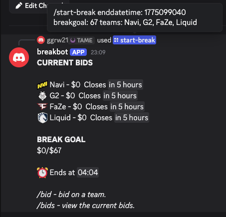
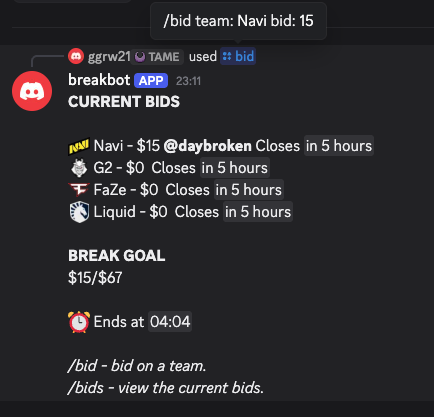

# Discord Auction Bot

A real-time auction system built as a Discord bot where users can place bids and track auctions. Originally designed for CS2 trading card auctions, but can easily be repurposed.

## Features
- Live bidding system
- Anti-snipe logic (extends auctions near the end)
- Automatic auction closing
- SQLite database for storing bids
- Multi item auction support
- Image support for items (based on keywords)
- Initialises database locally on startup
- Different channels can have different auctions running simultaneously

## How It Works
- Admins start auctions using slash commands, specifying item details and duration
- Users place bids in real time, with each bid validated and compared against the current highest bid
- Auction data is stored in a SQLite database
- A background async task continuously checks for auctions that have reached their end time and closes them automatically
- An anti-snipe system extends the auction duration if a bid is placed near the end
- The bot updates auction state dynamically and announces winners once auctions close

## Tech Stack
- Python
- discord.py
- SQLite
- asyncio

## Example Config File
Create a config.py file in the root directory.

```python
# Your Discord bot token (keep this secret!)
token = "YOUR_BOT_TOKEN_HERE"

emojis = {
    "liquid": "<:liquid:1322618534303371425>",
    "g2": "<:g2:1322618471162581126>",
    "navi": "<:navi:1322618445048709160>",
    "fire": "🔥",
    "money": "💰",
    "trophy": "🏆"
}
```
##Demo

### Starting an Auction


### Placing a Bid


### Available Commands

